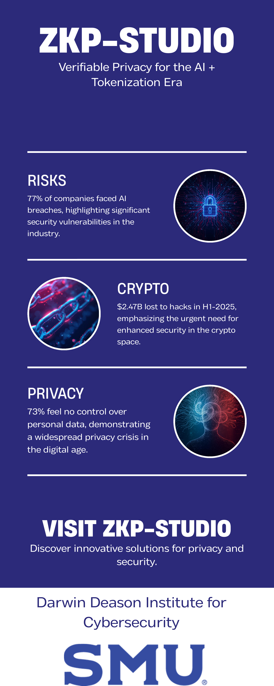

# ZKP-Studio

<p align="center">
  <a href="docs/Infographic_ZKP_Studio.pdf">
    
  </a>
  <br>
  <em>Verifiable Privacy for the AI + Tokenization Era</em>
  <br>
  <a href="docs/Infographic_ZKP_Studio.pdf">📄 View Full Resolution PDF</a>
</p>

---

## 🚀 Quick Links

- **[Live Demo](https://zkp.wave3ai.org/)** - Try ZKP-Studio now
- **[Documentation](docs/)** - Technical guides and tutorials
- **[AWS Research Award Proposal](proposal/)** - Learn about our research

---

## 🎯 The Problem We're Solving

- **77%** of companies faced AI breaches in 2024
- **$2.47B** lost to crypto hacks in H1-2025
- **73%** of users feel no control over personal data

**ZKP-Studio** provides an AI-assisted environment for designing, selecting, and validating zero-knowledge proof systems with provable security guarantees.

---

## 🏗️ Architecture

ZKP-Studio offers:

- **Policy-Aware ZKP Design** - AI-guided proof system selection based on your security requirements
- **Entropy-Budget Validation** - Quantify provable security bounds for your implementations
- **AWS-Native Infrastructure** - Built for CodeBuild, Lambda, Bedrock, Fargate, KMS, S3, and CloudWatch
- **Reproducible Experiments** - Open framework for comparing proof system performance

---

## 🛠️ Quick Start

```bash
# Clone the repository
git clone https://github.com/wave3ai-org/ZKP-Studio.git
cd ZKP-Studio

# Install dependencies
npm install

# Run locally
npm start
```

Visit `http://localhost:3000` to access ZKP-Studio locally.

---

## 📚 Documentation

- [Getting Started Guide](docs/getting-started.md)
- [Architecture Overview](docs/architecture.md)
- [API Reference](docs/api-reference.md)
- [Tutorial: Your First ZKP](docs/tutorials/first-zkp.md)

---

## 🎓 Research & Publications

Developed at the **Darwin Deason Institute for Cybersecurity** at Southern Methodist University.

**Principal Investigator:** Dr. Darrell L. Young (P.E.), Research Professor  
**Co-Investigator:** Dr. Mitchell A. Thornton (P.E.), Cecil H. Green Chair of Engineering

### Supporting Publications
- Young DL, "Impossibility Engineering," SPIE Defense + Commercial Sensing 2025
- Thornton MA et al., "Quantum-Resilient Cryptographic Architectures for IoT Edge Devices," IEEE 2023
- Young DL et al., "Policy-Bound Zero-Knowledge Proofs for Decentralized Markets," working paper 2025

---

## 📄 License

Apache 2.0 (open infrastructure only)

See [LICENSE](LICENSE) for details.

---

## 🤝 Contributing

We welcome contributions! Please see [CONTRIBUTING.md](CONTRIBUTING.md) for guidelines.

---

## 🏆 AWS Research Award

ZKP-Studio seeking funding from **Amazon Research Awards - Cybersecurity and Anti-Abuse Technologies** program.

---

## 📧 Contact

**Darwin Deason Institute for Cybersecurity**  
Southern Methodist University  
Dallas, Texas

- **Website:** [https://zkp.wave3ai.org/](https://zkp.wave3ai.org/)
- **Email:** [Contact via SMU-DDI](https://www.smu.edu/lyle/departments/cs/research/deason)

---

<p align="center">
  
  <br>
  <em>Darwin Deason Institute for Cybersecurity</em>
</p>
